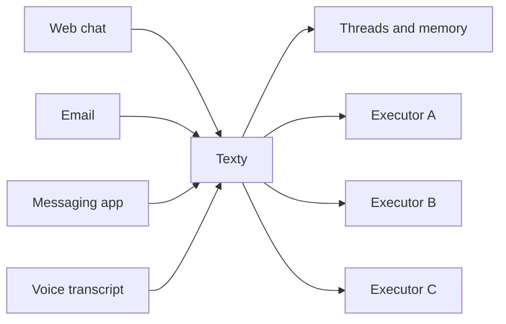

# texty

_coming soon..._

Texty is a hosted conversation layer for executable systems.

People talk to Texty. Texty keeps track of threads, context, and memory. When work needs to happen, Texty hands it off to a connected executor and then explains the result back to the user.

## Features

- conversation threads managed by Texty
- shared memory across normal conversations
- private threads that stay out of shared memory
- channel-aware continuity across web, messaging, email, and other inputs
- tool and workflow handoff to connected executors
- clarification flow when a request is missing information

## Why It’s Useful

Without Texty, every app or script that wants a conversational interface has to rebuild the same things:

- conversation history
- thread handling
- memory
- clarification questions
- channel continuity
- user-facing replies

Texty is meant to own those parts once, so connected systems can focus on doing useful work.

## Current Status

Texty is currently an MVP in progress.

The core shape is there, but the product is still being hardened and simplified before it should be treated as a stable hosted service.

## Quick Start

The main endpoint is:

```text
POST /api/v1/input
```

## Flow

Every message goes through the same first step:

1. A user sends input to Texty.
2. Texty loads the relevant thread and memory.
3. Texty decides what kind of response is needed.

There are then three main outcomes:

### 1. Direct reply

This happens when Texty can answer on its own.

Example:

- the user asks a question
- the answer is already in the thread or memory
- no outside work is needed

Why it matters:

- fastest path
- no executor call
- best for conversational continuity

### 2. Follow-up question

This happens when the request is real, but important details are missing.

Example:

- “Update the spreadsheet”
- but Texty does not know which spreadsheet or which row

Why it matters:

- prevents bad guesses
- keeps work accurate
- lets Texty gather what the executor will need before calling it

### 3. Executor handoff

This happens when work needs to be done outside Texty.

Example:

- updating a spreadsheet
- sending something to another system
- running a workflow or script

Why it matters:

- this is how Texty turns conversation into action
- Texty stays focused on the conversation
- the executor stays focused on doing the work



## Minimum Integration Flow

This is the smallest useful setup path for connecting an executor to Texty and getting a working request through the system.

1. Create an executor and get a token.
2. Sync the tools that executor exposes for a user.
3. Send user input to Texty.
4. Let Texty call the executor when work should happen.

There is a tiny reference executor here:

- [examples/minimal-executor/README.md](/Users/chris/Dev/texty/examples/minimal-executor/README.md)

## API Reference

### Authentication

Every API request needs this header:

```text
Authorization: Bearer YOUR_EXECUTOR_TOKEN
```

That token identifies which executor is calling Texty.

### Sync tools

Use this endpoint to tell Texty which tools an executor can expose for a specific user.

```shell
curl -X POST http://localhost:5173/api/v1/providers/provider_a/users/user_123/tools/sync \
  -H "Authorization: Bearer dev-token" \
  -H "Content-Type: application/json" \
  -d '{
    "provider_id": "provider_a",
    "user_id": "user_123",
    "tools": [
      {
        "tool_name": "spreadsheet.update_row",
        "description": "Update a spreadsheet row",
        "input_schema": {
          "type": "object",
          "properties": {
            "sheet": { "type": "string" },
            "row_id": { "type": "string" },
            "values": { "type": "object" }
          },
          "required": ["sheet", "row_id", "values"]
        },
        "status": "active"
      }
    ]
  }'
```

Field guide:

- `provider_id`
  - the executor id
  - this must match the executor making the request
- `user_id`
  - the end user who will be talking to Texty
  - use a stable id from your own app
- `tools`
  - the list of tools this executor wants Texty to use for this user
- `tool_name`
  - the name Texty will use when asking your executor to run something
- `description`
  - a plain-language explanation of what the tool does
  - Texty uses this to decide when the tool is relevant
- `input_schema`
  - the expected shape of the tool arguments
  - keep it simple and explicit
- `status`
  - whether the tool is currently available
  - use `active` when the tool should be callable

Plain English example:

- `provider_id = "provider_a"` means “this executor is called provider_a”
- `user_id = "user_123"` means “these tools are available for this user”
- `tool_name = "spreadsheet.update_row"` means “this tool updates a spreadsheet row”

### Send input

Use this endpoint when a user sends a message into Texty.

```shell
curl -X POST http://localhost:5173/api/v1/input \
  -H "Authorization: Bearer dev-token" \
  -H "Content-Type: application/json" \
  -d '{
    "provider_id": "provider_a",
    "user_id": "user_123",
    "input": {
      "kind": "text",
      "text": "Update the sales sheet and mark Acme as contacted"
    },
    "channel": {
      "type": "email",
      "id": "chris@example.com"
    }
  }'
```

Field guide:

- `provider_id`
  - the executor id
  - tells Texty which executor this conversation belongs to
- `user_id`
  - the end user speaking through Texty
  - this is how Texty keeps memory and threads tied to the right person
- `input`
  - the actual thing the user sent
- `input.kind`
  - the type of input
  - for now, the main value is `text`
- `input.text`
  - the user’s message
- `channel`
  - where the message came from
- `channel.type`
  - the kind of surface, such as `web`, `email`, or `messaging`
- `channel.id`
  - the identity of that surface for this user
  - examples: an email address, a browser session id, or a messaging account id

Why `channel` matters:

- Texty shares memory at the user level
- but it can keep different recent thread continuity per channel

Plain English example:

- `channel.type = "email"` means “this came from email”
- `channel.id = "chris@example.com"` means “this specific email identity sent the message”

### List threads

Use this endpoint to fetch the threads Texty knows about for a user.

```shell
curl http://localhost:5173/api/v1/providers/provider_a/users/user_123/threads \
  -H "Authorization: Bearer dev-token"
```

This is mostly useful for admin tools, debug screens, or a UI that wants to show past threads.

### Response behavior

- responses include `request_id` and `X-Request-Id`
- write routes support `Idempotency-Key`
- input is rate-limited per executor/user pair
- normal conversations are captured into memory by default
- private threads are excluded from shared-memory capture and retrieval
- Texty can use Cloudflare Workers AI for the routing step before executor handoff

Optional routing model setting:

- `CLOUDFLARE_DECISION_MODEL`
  - use this to choose the Workers AI model for routing and intent decisions
  - if unset, Texty uses `@cf/meta/llama-3.1-8b-instruct-fast`

Execution states:

- `completed`
- `needs_clarification`
- `accepted`
- `in_progress`
- `failed`

Meaning:

- `completed`
  - the executor finished the work
- `needs_clarification`
  - more information is needed before work can continue
- `accepted`
  - the executor accepted the work but has not finished yet
- `in_progress`
  - the work is actively running
- `failed`
  - the executor could not complete the work

## Scripts

- `npm run dev`
- `npm run check`
- `npm run build`
- `npm test`
